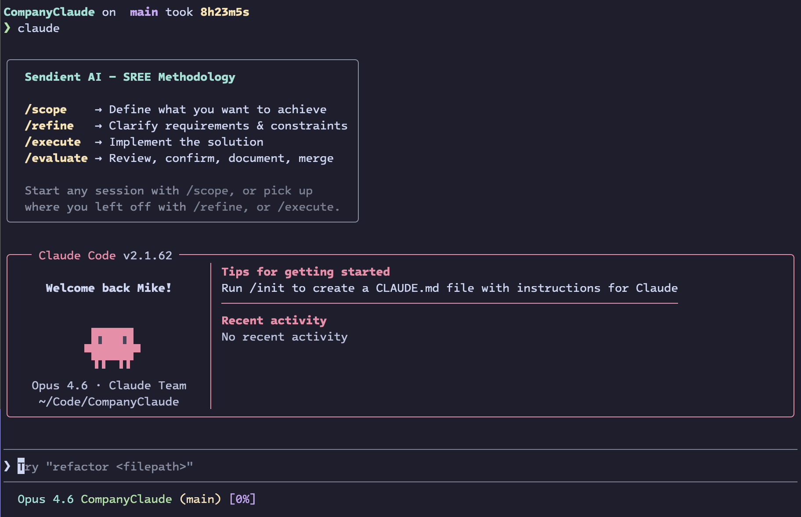

# Company Claude



Wrapper and tooling for running Claude Code with the Sendient SREE methodology banner and [`run`](https://github.com/nihilok/run) task runner integration.

## Quick install

**macOS / Linux:**

```sh
# From the repo
./install.sh

# Remote (no token needed — uses secret gists)
curl -fsSL <GIST_URL_INSTALL_SH> | bash
```

**Windows (PowerShell):**

```powershell
# From the repo
pwsh ./install.ps1

# Remote (no token needed — uses secret gists)
irm <GIST_URL_INSTALL_PS1> | iex
```

> **Note:** The `<GIST_URL_*>` placeholders above are replaced with real URLs
> after the first push to `main` triggers the gist sync workflow. See
> [Distribution](#distribution) below.

The installer checks for (or installs) Claude Code and `run`, then:

1. Copies the `sendient-claude` wrapper to `~/.sendient/bin/claude`
2. Prepends `~/.sendient/bin` to your PATH
3. Configures the `runtool` MCP server in `~/.claude.json`
4. Installs Runfile tasks to `~/.runfile`

## What you get

**Wrapper** — Running `claude` shows the SREE methodology banner before launching the real Claude Code binary. Non-interactive invocations (`--print`, `--json`, etc.) skip the banner.

**Runfile tasks** — Available globally via `run <task>`:

| Task | Description |
|------|-------------|
| `company_claude:install` | Fetch and run the remote installer (works from anywhere) |
| `company_claude:update` | Alias for `install` — re-runs the installer to update everything |
| `company_claude:doctor` | Health check — verifies Claude Code, `run`, wrapper, MCP, and epics directory |
| `company_claude:uninstall` | Remove the wrapper |
| `epic_search <id>` | Look up a Shortcut epic by number (e.g. `run epic_search 8894`) |

## Distribution

Files are published to secret gists via a GitHub Actions workflow on every push to `main`. Gist URLs are stored as repository variables:

| Variable | File |
|----------|------|
| `GIST_URL_INSTALL_SH` | `install.sh` |
| `GIST_URL_INSTALL_PS1` | `install.ps1` |
| `GIST_URL_SENDIENT_CLAUDE` | `sendient-claude` |
| `GIST_URL_SENDIENT_CLAUDE_CMD` | `sendient-claude.cmd` |
| `GIST_URL_RUNFILE` | `Runfile` |

**First-time setup:** Create a GitHub PAT with `gist` and `repo` (variables) scopes and add it as the `GIST_TOKEN` repository secret. Then trigger the workflow manually or push to `main`.

## Environment variables

| Variable | Default | Description |
|----------|---------|-------------|
| `SENDIENT_INSTALL_DIR` | `~/.sendient/bin` | Where the wrapper is installed |
| `SENDIENT_EPICS_DIR` | *(required)* | Path to epic markdown files |
| `SENDIENT_EPICS_FILE` | *(required)* | Path to the epics index file |
| `SENDIENT_URL_WRAPPER` | *(from gist)* | Direct URL to the wrapper script |
| `SENDIENT_URL_RUNFILE` | *(from gist)* | Direct URL to the Runfile |
| `SENDIENT_REPO_URL` | `https://raw.githubusercontent.com/Sendient/company-claude/main` | Fallback for remote installs (requires `GITHUB_TOKEN`) |

## Prerequisites

- [Claude Code](https://docs.anthropic.com/en/docs/claude-code) (installer will attempt `npm install` if missing)
- [`run`](https://github.com/nihilok/run) task runner (installer will attempt install if missing)
- `jq` (for MCP config)
